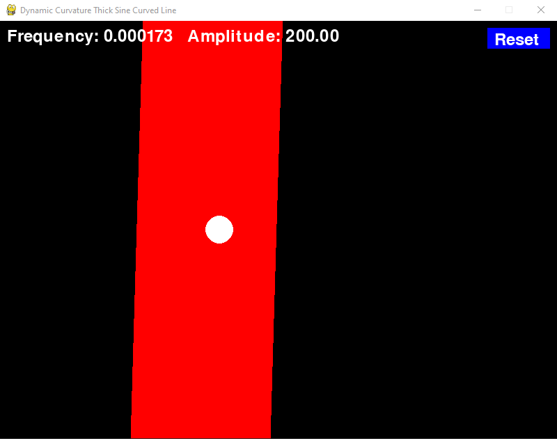

## Driving Aptitude Test Game
v0.1

### Overview

The Driving Aptitude Test Game is a simulation-based game inspired by the Spanish driving aptitude test for individuals over 70 years of age. This game assesses the player's speed, positional awareness, and hand stability as they control a ball that navigates a curved path while avoiding obstacles. The curved path dynamically changes its shape, providing an engaging challenge that tests the player's reaction time and precision.

### Features

Dual Simulations: The game features two side-by-side simulations, each with its own curved path and controllable ball. The player can control one ball using the WASD keys and the other ball using the arrow keys.
Dynamic Curvature: The curvature of the path changes dynamically over time, creating an unpredictable and exciting gameplay experience.
Transition Effects: The transition from one curvature to another is smooth and gradual, offering a visually pleasing experience.
Out of Bounds Alert: An out-of-bounds alert is triggered when the player's ball goes beyond the permissible area. This is indicated by a sound alert and is accompanied by a visual indication.
Reset Option: A reset button allows players to reset the game at any time.
Interactive Interface: The game features an intuitive interface with real-time information about frequency, amplitude, and controls.
High FPS: The game is designed to run at a high frame rate, providing a smooth and responsive experience.
Future Plans
Joystick Support: We plan to add compatibility for joystick support, allowing players to use game controllers for a more immersive experience.
Mobile App: We aim to develop a mobile application version of the game, making it accessible to a wider audience. The app will be available on both the Apple App Store and Google Play Store.

### Installation and Usage
Clone this repository to your local machine.
Ensure you install the relevant packages by running pip install -r requirements.txt in the dir.
Run the game by executing python game-single.py.
Alternatively, experiment with and improve ./experiments/game-multiple-exp.py

### Credits
This game was developed by Arslan Badr and Santiago Quintana-Amate as a fun and challenging simulation-based game with the practival useability.

### DISCLAIMER
This is in no way endored by any government / enforcement authority and is solely meant for practice of the actual test, use at your own risk.

### License
This project is licensed under the MIT License.

